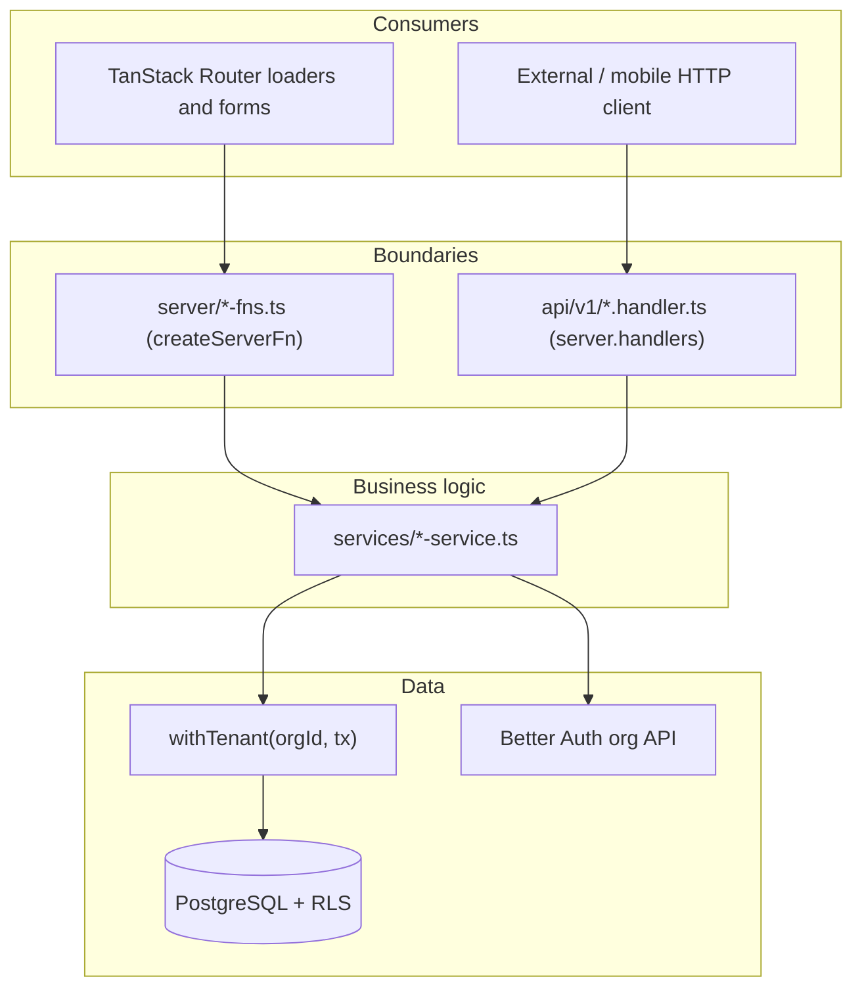

# API layer

## ORM: Drizzle (not Prisma)

This project uses **Drizzle ORM** + `drizzle-kit`, never Prisma. Prisma appears
only as an unused optional peer of `better-auth` in the lockfile — do not add a
`schema.prisma` or a Prisma client.

| Concern | Location |
|---|---|
| Schema | `packages/db/src/schema/` (auth + business tables) |
| Client (pg Pool + Drizzle) | `packages/db/src/client.ts` |
| Tenant context | `packages/db/src/tenant.ts` (`withTenant`) |
| Migrations | `packages/db/migrations/` (SQL + RLS policies) |
| drizzle-kit config | `packages/db/drizzle.config.ts` |

DB commands (run from the repo root):

```bash
pnpm --filter @rk-kit/db db:generate   # diff schema → migration SQL
pnpm --filter @rk-kit/db db:migrate    # apply pending migrations
pnpm --filter @rk-kit/db db:studio     # visual browser
```

See [data-access.md](./data-access.md) for the tenant-isolation contract that
every business query must follow.

## The four layers

A request flows through at most four layers. Each has one responsibility:

| Layer | Path | Responsibility |
|---|---|---|
| Route | `apps/web/src/routes/` | UI routing + wiring HTTP `server.handlers` |
| Server function | `apps/web/src/server/*-fns.ts` | Front boundary: Zod validate → `requireOrganization` → delegate |
| REST handler | `apps/web/src/api/v1/*.handler.ts` | External boundary: same validate/authorize, returns JSON |
| Service | `apps/web/src/services/*-service.ts` | Business logic + Drizzle via `withTenant` |

Both boundaries (server functions and REST handlers) call the **same services**
— business logic and SQL are written once.



## Naming conventions

| Suffix | Meaning | Example |
|---|---|---|
| `*-service.ts` | Pure business logic, server-only, `withTenant` | `project-service.ts` |
| `*-fns.ts` | TanStack Start server functions (front RPC) | `projects-fns.ts` |
| `*.handler.ts` | REST handler functions returning `Response` | `projects.handler.ts` |

Auth for every boundary comes from the session — never trust a client-provided
`organizationId`. Use `requireOrganization(request.headers)` from `@rk-kit/auth`.

## Server functions (front)

Colocated under `apps/web/src/server/`. Pattern:

```ts
export const createProjectFn = createServerFn({ method: "POST" })
  .validator(createProjectSchema)                 // 1. validate at the boundary
  .handler(async (ctx) => {
    const request = getRequest();
    const { organizationId } = await requireOrganization(request.headers); // 2. authorize
    return createProject(organizationId, ctx.data);  // 3. delegate to a service
  });
```

Routes import these in their `loader` / event handlers; they never define server
functions inline anymore.

## REST API (`/api/v1/*`)

TanStack Start routes using `server.handlers` (same mechanism as the Better Auth
catch-all in `routes/api/auth.$.ts`). Handlers live in `apps/web/src/api/v1/`
and are wired by thin route files in `apps/web/src/routes/api/v1/`.

Auth reuses the **Better Auth session cookie** via `requireOrganization`. This
covers the front and same-origin integrations. Bearer-token / API-key auth for
tokenless external clients is out of scope until there is a real consumer.

Standard JSON envelope:

```jsonc
// success (200 / 201)
{ "data": { /* ... */ } }

// error (4xx / 5xx) — serialized from @rk-kit/errors
{ "error": { "code": "NOT_FOUND", "message": "Project not found" } }
```

The shared middleware `apps/web/src/api/middleware/require-api-session.ts`
resolves the session and maps thrown `@rk-kit/errors` to the envelope above via
`handleUnknownError`.

## Endpoint map

| Domain | Server function | REST | Backend |
|---|---|---|---|
| Session guard | `getProtectedContext`, `getServerSession` | — | Better Auth |
| OAuth providers | `getEnabledOAuthProvidersFn` | — | `@rk-kit/auth` |
| Projects — list | `listProjectsFn` | `GET /api/v1/projects` | `project-service` |
| Projects — create | `createProjectFn` | `POST /api/v1/projects` | `project-service` |
| Projects — read | `getProjectFn` | `GET /api/v1/projects/:id` | `project-service` |
| Projects — update | `updateProjectFn` | `PATCH /api/v1/projects/:id` | `project-service` |
| Projects — delete | `deleteProjectFn` | `DELETE /api/v1/projects/:id` | `project-service` |
| Team — list | `getTeamData` | `GET /api/v1/team` | `team-service` |
| Team — invite | `inviteMemberFn` | `POST /api/v1/team/invitations` | `team-service` |
| Team — remove | `removeMemberFn` | `DELETE /api/v1/team/members/:id` | `team-service` |

## Out of scope (add on a real trigger)

- API keys / Bearer tokens for tokenless external clients
- tRPC (server functions + REST already cover current needs)
- Stripe / billing API — see [add-module.md](./add-module.md)
- OpenAPI / versioned schema docs
